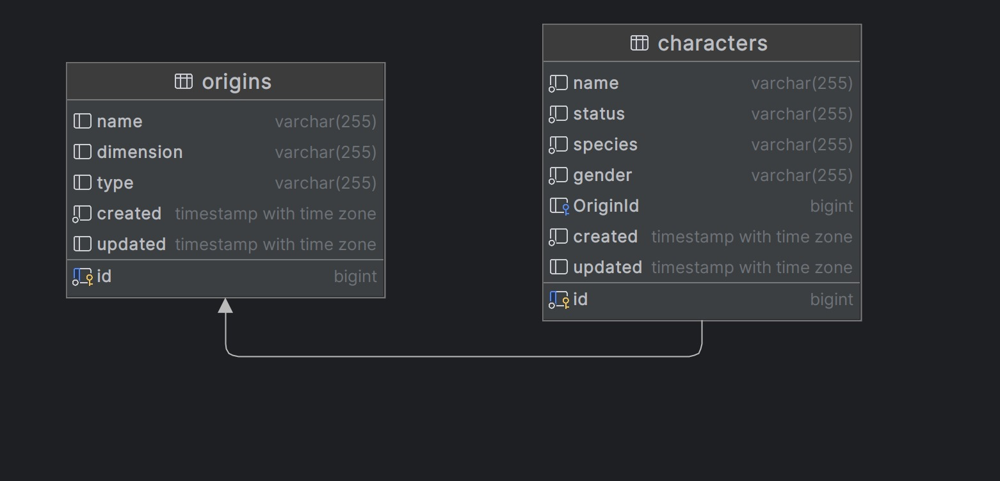
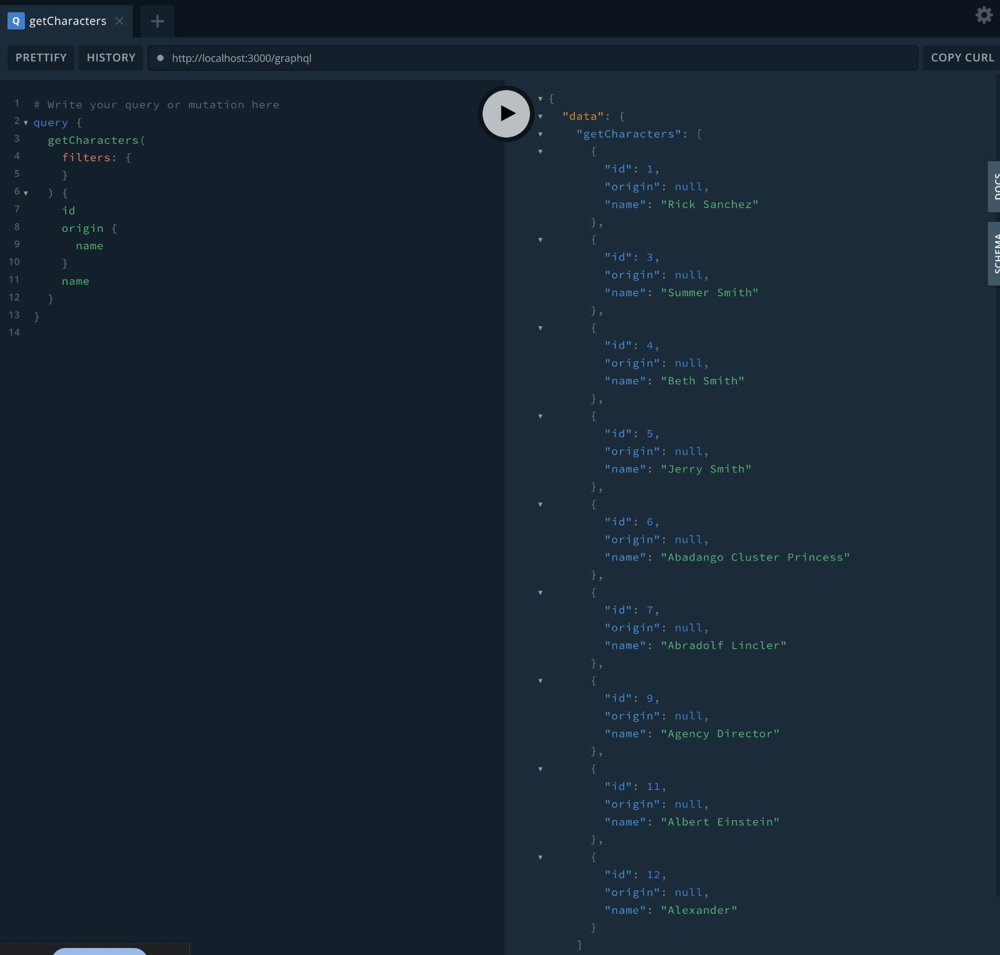
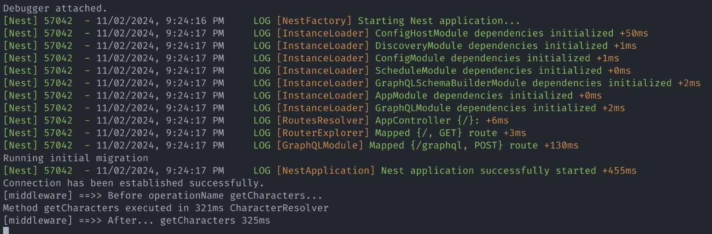

## modelo entidad relacion


## graph QL 


## Interceptor


## STEPS
- estos pasos deben ser ejecutados en orden
- tener en cuenta que todos son dispuestos desde la carpeta raiz

## Deploy infraestructure

```bash
$ cd infra 
$ docker-compose up -d
```

## Migration

```bash
$ cd migrations
$ npx sequelize-cli db:migrate --env development
```

## Run
```bash
$ cd test-rick-and-morty
$ npm install
$ npm run start:dev
```
